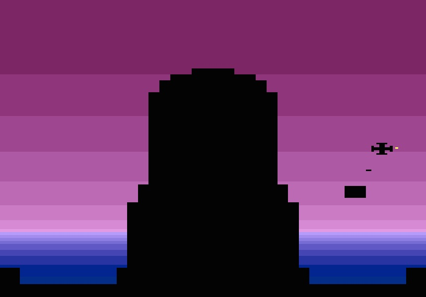

# tractorbeam-2600
A game for the Atari 2600

Still work in progress. More levels to be added, and hopefully more stuff that moves.

To compile, you need the dasm assembler. The file `compile.sh` assumed that it is located one directory up from the current directory, in a directory called `dasm`.
You may also need to edit the path to the include files at the start of `game.asm`.

To play, compile and then load `out.bin` into an emulator such as Stella.
